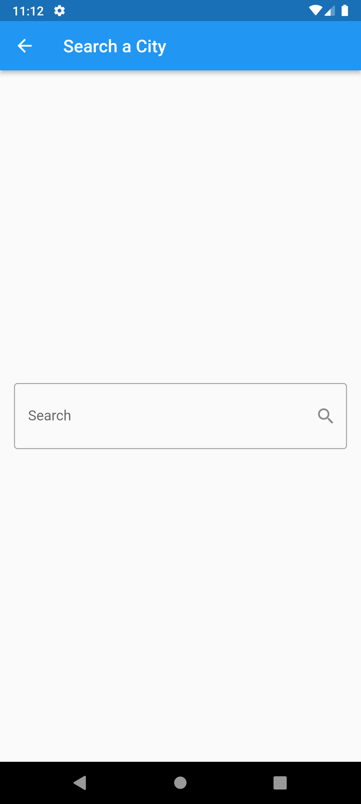

# Weather App 🌤️

A beautiful Flutter weather application that provides real-time weather information for cities worldwide. Built with BLoC state management pattern for efficient and scalable architecture.

## Features

- 🔍 Search weather by city name
- 🌡️ Display current temperature, max/min temperatures
- 🎨 Dynamic theme colors based on weather conditions
- 🖼️ Weather-specific icons and imagery
- 📅 Local date and time display
- 🌈 Beautiful gradient backgrounds matching weather conditions
- ⚡ Real-time weather updates

## Screenshots

## Home Screen

<p align="center">
  
    
  

</p>

---

## Search Screen
<p align="center">
  
  
</p>

---

The app features different color themes based on weather conditions:
- ☀️ **Sunny/Clear**: Orange gradient
- 🌨️ **Snow/Sleet**: Blue gradient
- ☁️ **Cloudy**: Blue-grey gradient
- 🌧️ **Rainy**: Blue gradient
- ⛈️ **Thunderstorm**: Deep orange gradient

## Architecture

This project follows the **BLoC (Business Logic Component)** pattern for state management, ensuring:
- Clear separation of concerns
- Testable business logic
- Reactive programming approach
- Scalable and maintainable codebase

### Project Structure

```
lib/
├── cubits/
│   └── weather_cubit/
│       ├── weather_cubit.dart
│       └── weather_state.dart
├── models/
│   └── weather_model.dart
├── screens/
│   ├── home_screen.dart
│   └── search_screen.dart
├── services/
│   └── weather_service.dart
├── widgets/
│   └── weather_body.dart
└── main.dart
```

## Dependencies

```yaml
dependencies:
  flutter:
    sdk: flutter
  flutter_bloc: ^9.1.1
  http: ^1.3.0
  cupertino_icons: ^1.0.8
  provider: ^6.1.4
```

## Setup

### Prerequisites

- Flutter SDK (version 3.7.2 or higher)
- Dart SDK
- Android Studio / VS Code with Flutter extensions
- An API key from [WeatherAPI.com](https://www.weatherapi.com/)

### Installation

1. **Clone the repository**
   ```bash
   git clone <[repository-url](https://github.com/mohamed-oraby10/weather_app)>
   cd weather_app
   ```

2. **Install dependencies**
   ```bash
   flutter pub get
   ```

3. **Add your API key**
   
   Open `lib/services/weather_service.dart` and replace the API key:
   ```dart
   String apiKey = "YOUR_API_KEY_HERE";
   ```

4. **Add weather images**
   
   Place the following images in `assets/images/`:
   - `clear.png` - For sunny/clear weather
   - `snow.png` - For snowy conditions
   - `cloudy.png` - For cloudy weather
   - `rainy.png` - For rainy conditions
   - `thunderstorm.png` - For thunderstorms

5. **Run the app**
   ```bash
   flutter run
   ```

## Usage

1. **Launch the app** - You'll see the home screen with a prompt to search for a city
2. **Tap the search icon** in the app bar
3. **Enter a city name** in the search field
4. **Press enter** or submit to fetch weather data
5. **View weather information** including:
   - City name
   - Current temperature
   - Maximum and minimum temperatures
   - Weather condition
   - Last update time
   - Weather-appropriate icon

## State Management

The app uses **flutter_bloc** for state management with the following states:

- `WeatherInitial` - Initial state when app launches
- `WeatherLoading` - While fetching weather data
- `WeatherSuccess` - Weather data successfully loaded
- `WeatherFailure` - Error occurred while fetching data

## API Integration

The app uses the [WeatherAPI.com](https://www.weatherapi.com/) API to fetch:
- Current weather conditions
- Temperature data (current, max, min)
- Weather descriptions
- Local time information
- 7-day forecast data

## Error Handling

The app includes robust error handling:
- Network connection errors
- Invalid city names
- City name mismatch validation
- API request failures

## Customization

### Adding New Weather Conditions

Edit `lib/models/weather_model.dart`:

1. Add new condition in `getImage()` method
2. Add corresponding theme color in `getThemeColor()` method
3. Add the image asset to `assets/images/`

### Changing Theme Colors

Modify the `getThemeColor()` method in `weather_model.dart` to customize colors for different weather conditions.

## Contributing

Contributions are welcome! Please feel free to submit a Pull Request.

## Acknowledgments

- Weather data provided by [WeatherAPI.com](https://www.weatherapi.com/)
- Built with [Flutter](https://flutter.dev/)
- State management using [flutter_bloc](https://pub.dev/packages/flutter_bloc)

  
## Author

**Mohamed Oraby**
- GitHub: [@mohamed-oraby10](https://github.com/mohamed-oraby10)

## Support

For issues, questions, or suggestions, please open an issue in the repository.

---

Made with ❤️ using Flutter
